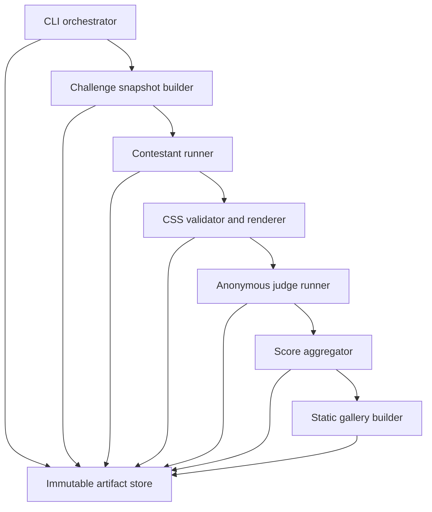

# 02 — System Architecture

## Technology choices

Phase 1 should use:

- Node.js `24.x` LTS, pinned in `.nvmrc` and `package.json#engines`;
- TypeScript in strict mode;
- `pnpm` with a committed lockfile;
- Playwright's bundled Chromium;
- Handlebars for build-time HTML generation;
- Zod for runtime validation of config and JSON artifacts;
- PostCSS and `postcss-value-parser` for structural stylesheet validation;
- Sharp for deterministic contact-sheet composition;
- Vitest for unit and integration tests;
- plain static HTML and CSS for the public gallery; and
- filesystem artifacts as the only source of truth.

Do not add React, Next.js, Astro, a database, Docker, or a web server framework in Phase 1. A small static file server used only for local rendering is sufficient.

Playwright supplies native Apple Silicon browser binaries. Do not use Rosetta or an independently installed system Chrome.

## High-level components



## Repository layout

```text
.
├── challenge/
│   └── season-001/
│       ├── challenge.hbs
│       ├── challenge.yaml
│       ├── starter.css
│       ├── fallback.css
│       ├── fonts/
│       └── seed/
├── config/
│   ├── contestants.yaml
│   └── judges.yaml
├── src/
│   ├── cli/
│   ├── config/
│   ├── challenge/
│   ├── contestants/
│   ├── validation/
│   ├── rendering/
│   ├── judging/
│   ├── scoring/
│   ├── gallery/
│   └── artifacts/
├── prompts/
│   ├── contestant-generation-1.md.hbs
│   ├── judge-candidate.md.hbs
│   └── judge-awards.md.hbs
├── generations/
├── test/
│   ├── fixtures/
│   ├── integration/
│   └── unit/
├── package.json
├── pnpm-lock.yaml
└── tsconfig.json
```

Do not commit real credentials or model responses. Whether completed generations are committed is an operator decision made after Phase 1.

## CLI contract

Provide one executable named `garden` through a package script.

Required commands:

```text
pnpm garden verify
pnpm garden create-generation --season 001
pnpm garden run-generation --generation 0001
pnpm garden resume-generation --generation 0001
pnpm garden build-gallery --generation 0001
pnpm garden serve-gallery --generation 0001
```

### `verify`

Validates runtime versions, Playwright browser availability, configs, challenge files, fonts, seed assets, and command executables without invoking models.

### `create-generation`

Allocates the next immutable generation directory, resolves the challenge HTML snapshot, copies the exact config snapshot, hashes inputs, assigns anonymous candidate IDs, and writes a manifest with status `created`.

It must refuse to reuse an existing generation number.

### `run-generation`

Executes the state machine from the current safe point. It must refuse to mutate a generation marked `completed`.

### `resume-generation`

Continues incomplete work without rerunning successful contestant or judge tasks. It may retry only tasks that never produced a terminal result. A terminal failure such as contestant timeout is not retried.

### `build-gallery`

Builds static public output only after leaderboard aggregation. Rebuilding must be deterministic and must not mutate candidate or judge artifacts.

### `serve-gallery`

Starts a local static server and prints its localhost URL. It must not expose a non-loopback interface by default.

## Generation state machine

Use these generation states:

```text
created
snapshot_ready
contestants_running
contestants_complete
renders_complete
judging_complete
scored
gallery_complete
completed
```

Each contestant and judge task also has an independent terminal status.

Persist state after every task, not merely after a whole stage. Write JSON atomically using a temporary sibling file followed by rename.

## Challenge snapshot builder

Inputs:

- season template;
- season metadata;
- previous generation leaderboard or seed data;
- fixed content assets;
- contestant roster shape.

Outputs:

- resolved `challenge.html`;
- copied local content assets;
- SHA-256 for every input and output;
- `snapshot.json` describing source versions.

All contestants in the generation receive the same read-only snapshot directory. Do not render a separate HTML file with contestant-specific names or hints.

## Contestant adapter

Phase 1 requires a generic command adapter plus a fixture adapter.

The generic command adapter configuration uses an argument array, never a shell command string. It receives:

- isolated working directory;
- challenge HTML path;
- starter CSS path;
- prompt path;
- required output path;
- timeout;
- optional environment-variable allowlist; and
- optional model usage output path.

The process working directory contains a private copy of the challenge snapshot. The canonical generation snapshot remains outside the writable directory.

Collect only `submission.css` and declared metadata. Ignore other files. Record them in diagnostics if useful, but do not publish hidden harness scratch data by default.

### One-shot enforcement

- Do not expose Playwright, Chrome, Safari, screenshot utilities, or the prior generation's full competitor images in the contestant workspace.
- Set an eight-minute hard wall-clock timeout by default.
- Set a `30,000` total-token ceiling when the harness supports it.
- Do not retry a terminal execution.
- Deny browser-launch commands where the harness sandbox supports command restrictions.
- Record whether token enforcement was supported.

The system cannot make all harnesses economically identical. It must record the budget and usage honestly.

## CSS validator

Perform static validation before launching Chromium. Return a structured list of errors and warnings. A static validation error marks the candidate `invalid` and skips rendering.

Do not implement an automatic CSS repair step.

## Rendering service

Serve each candidate from an ephemeral loopback origin using the same local server implementation. Browser routing must abort requests whose origin is not that server.

For each valid candidate:

1. create a fresh browser context;
2. set the exact viewport and emulation values;
3. disable JavaScript;
4. navigate to the local challenge page;
5. wait for `document.fonts.ready` through a browser-side evaluation that does not enable page JavaScript;
6. wait one additional deterministic render tick;
7. run post-render checks;
8. capture `screenshot.png`; and
9. close the context.

The browser may be shared across candidates, but the context may not.

## Judge adapter

Phase 1 requires a generic command adapter and fixture adapter. It receives a prompt, the candidate screenshot, the sanitised CSS, and the cohort contact sheet. It must write JSON conforming to the judgment schema.

Each judge-candidate call has a three-minute default timeout and no automatic retry after a terminal model response, even if the response schema is invalid. A transport failure before any response may be resumable if the adapter can prove the request was not accepted; otherwise mark the outcome uncertain.

CSS comments must be removed before source is given to judges. Never expose contestant display names, provider names, model names, harness names, paths containing them, or original CSS filenames.

## Contact-sheet builder

Create one `1600 × 900` anonymous cohort contact sheet per judge after candidate rendering. Requirements:

- neutral white or mid-grey background;
- no contestant identities;
- anonymous candidate ID and status only;
- consistent thumbnail boxes with no cropping;
- enough screenshot resolution for broad palette, typography, density, and layout to remain legible;
- no scores, ranks, or judge results because it is built before judging; and
- a stored judge-specific random cell order that does not reveal execution order.

All judge contact sheets contain the same screenshots at the same scale, but use independently randomised cell order. In later generations, create a separate public contact sheet containing contestant identities and rankings for contestant briefings and sharing.

## Aggregator

The aggregator is pure: identical judgments and candidate metadata must produce byte-equivalent leaderboard JSON apart from an explicitly supplied generation timestamp.

It calculates raw scores and ranking according to `04-judging-and-ranking-protocol.md`. It never calls a model.

## Gallery builder

Inputs:

- current leaderboard;
- current candidate screenshots;
- current judgments and awards;
- current champion CSS or fallback CSS;
- immutable challenge template.

Outputs:

```text
public/
  index.html
  champion.css
  gallery-screenshot.png
  screenshots/
  fonts/
  metadata.json
```

The output must work when served statically with JavaScript disabled and external network access blocked.

After building the public page, render it once at the same `1440 × 1200` desktop settings and save `gallery-screenshot.png`. This is the standard shareable generation image. It is derived output and is never used to judge that same generation.

## Isolation and security

- Rendering browser network is loopback-only.
- Contestant credentials are passed only through an explicit environment allowlist.
- Never copy the full parent environment into a contestant process.
- Redact configured secret values from logs.
- Use `spawn` with an argv array and `shell: false`.
- Never interpolate model output into a shell command.
- Treat CSS and judge output as untrusted input.
- Escape all model-generated critique and award text before inserting it into HTML.
- Content Security Policy for gallery pages should deny scripts and remote resources.
- Keep canonical challenge inputs outside writable contestant workspaces.

## Local M4 execution guidance

The M4 Mac mini is more than sufficient for Chromium rendering. API calls, not rendering, will dominate elapsed time.

Defaults:

- maximum four contestant processes concurrently;
- maximum two judge calls concurrently per judge configuration;
- one Chromium browser process with fresh contexts;
- PNG screenshots using default lossless compression;
- no Docker or virtual machine layer.

Concurrency must be configurable because model provider rate limits vary.
